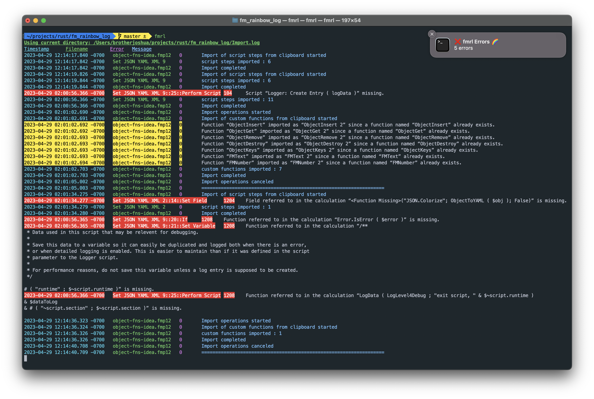

# FM Rainbow Log (fmrl)

`fmrl` (pronounced like Earl with a "fmuh") is a cross-platform command line tool to:

- 🥸 watch FileMaker Import.log files for changes
- 🦄 colorize the output
- 🚨 and highlight errors and warnings.

It displays real-time updates for both custom Import.log paths as well as the default (Documents) location when working with hosted fmp12 files.



## Motivation

FileMaker's Import.log file is helpful when importing/copying between files, but it's difficult to parse visually. Errors and warnings get buried, and columns don't align. Plus, the default macOS log viewer, Console.app wraps lines unnecessarily 🤨.

Furthermore, FileMaker calcs don't play nice with other CLI utilities like `tail` because they sometime use non-standard `\r` line endings. `fmrl` appends linefeeds as needed so messages aren't truncated when printing in the terminal.

## Installation

If installing locally, I prefer using cargo (described below), becuase it streamlines updates and avoids macos permission issues. But pre-compiled binaries are also available.

### Via pre-compiled binaries

1. Copy the `fmrl` binary (see below) to a directory in your PATH. For example, `/usr/local/bin` on macOS.
    - To see the folders in your PATH, run this in your terminal: `echo $PATH | sed -E 's/:/\n/g'`
2. Restart your terminal and type `fmrl --help`.

Binaries are available in the [Releases](https://github.com/jwillinghalpern/fm_rainbow_log/releases) section of this repo.

NOTE: On MacOS, the first time you run the program you'll encounter a security warning. [See here](./readme-files/macos-security.md)

### Via 🦀 rust/cargo

```bash
cargo install --git https://github.com/jwillinghalpern/fm_rainbow_log.git
```

To update fmrl, re-run the above command any time.

If you don't have cargo, [follow this one easy step](https://doc.rust-lang.org/cargo/getting-started/installation.html)

### Development/contribution

Simply clone this repo, cd to the directory, and run `cargo run` to test in debug mode. If you are planning a big feature or change, please open an issue first to discuss.

## Usage

watch Import.log in current directory:

```bash
fmrl
```

watch Import.log in your local Documents directory (default location when working with hosted files):

```bash
fmrl --docs-dir
# or short version:
# fmrl -d
```

print a separator between each import operation:

```bash
fmrl -s
```

watch for only errors and warnings:

```bash
fmrl  --errors-only --warnings-only
# or short version:
# fmrl -e -w
```

show desktop notifications for errors and warnings:

```bash
fmrl --notifications
```

show help (it's helpful)

```bash
fmrl --help
```

Specify custom colors [see section below for how to configure](#customize-colors-and-options-using-a-config-file)

```bash
fmrl -c path/to/config.json
```

don't watch for changes, just print the log once:

```bash
fmrl --no-watch
```

play sound! (mac only)

```bash
fmrl --beep
# or make it fancier!
fmrl --notifications --beep --beep-volume 0.8 --beep-path /System/Library/Sounds/Frog.aiff
```

generate an auto-completion script (store somewhere in your $fpath):

```bash
# zsh example. Omit "zsh" to see options.
fmrl --completion zsh

# here's where I put it
fmrl --completion zsh > ~/.oh-my-zsh/completions/_fm_rainbow_log
```

### Customize colors and options using a config file

To customize colors and default options, create a json file somewhere on your computer (any name) and follow the following format. All keys are optional, e.g. you can omit "background for any field, or omit the field entirely.".

```json
{
  "show_separator": false,
  "use_documents_directory": false,
  "errors_only": false,
  "warnings_only": false,

  "show_notifications": false,

  "beep": false,
  "beep_volume": 1.0,
  "beep_path": "/System/Library/Sounds/Tink.aiff",

  "colors": {
    "timestamp": {
      "foreground": "",
      "background": ""
    },
    "filename": {
      "foreground": "",
      "background": ""
    },
    "error": {
      "foreground": "",
      "background": ""
    },
    "message": {
      "foreground": "",
      "background": ""
    }
  }
}

```

Then pass the path to that file to `fmrl` with the `-c` option:

```bash
fmrl -c path/to/config.json
```

_NOTE: if you always want to use the same custom configuration, you can save the file in your config directory at these locations and then fmrl will use that by default:_

- Mac: `$HOME/Library/Application Support/fm_rainbow_log/config.json`
  - example: /Users/Alice/Library/Application Support/fm_rainbow_log/config.json
- Windows: `{FOLDERID_RoamingAppData}\fm_rainbow_log\config.json`
  - example: C:\Users\Alice\AppData\Roaming\fm_rainbow_log\config.json

For now the only color options are ANSI colors, but I'd like to add RGB support in the future for terminals which support it:

- black
- red
- green
- yellow
- blue
- magenta
- purple
- cyan
- white
- bright black
- bright red
- bright green
- bright yellow
- bright blue
- bright magenta
- bright cyan
- bright white

## Notes

- Currently fmrl only supports the English language, but there is an open issue to address this soon.
- Most terminals let you customize the ANSI colors, so feel free to modify the colors to your liking!
- On Windows I've only tested PowerShell. There are certain cases where the color escape sequences don't display properly, and show garbled text. I'm not sure how to handle every edge case (please submit suggestions/pull requests if you do).
- This is a WORK IN PROGRESS. Everything about it is subject to change, including the name and usage instructions.
