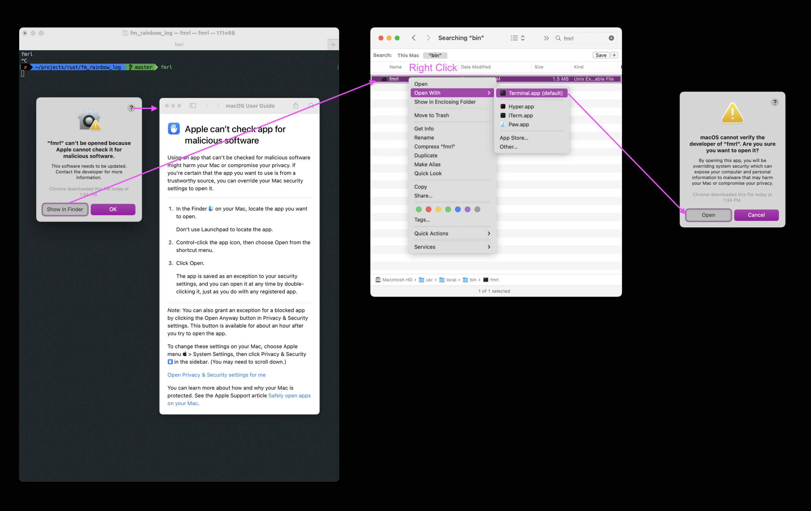

# Granting the binary permission to run on MacOS

If you install using rust and cargo, then this won't be an issue, but if you download the pre-compiled binary for mac, follow these steps the first time you run the program.

1. Find the `fmrl` file in the finder
2. right click (ctrl-click) the file and select "Open" (or "Open with")
3. You'll be prompted to confirm you want to open the file. Select "Open"

or if you try to fmrl from the terminal before granting permission, you might see warnings like this. Follow the visual:

